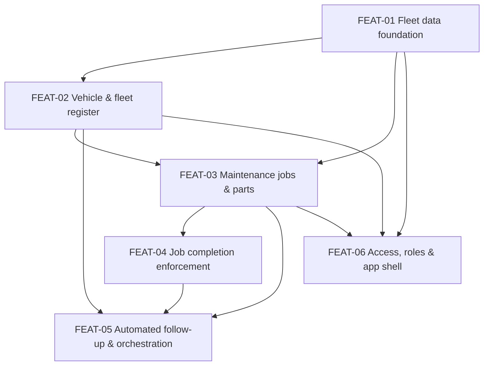

# Feature index

Epic and feature structure for the Contoso Service fleet-maintenance backlog.
This index is human-facing navigation; the authoritative membership lives in each
requirement's `feature`/`epic` front-matter and each feature workspace `spec.md`.

Intake requirement groups (`INTK-0001-GRP-01..08`) are contextual navigation only.
A feature may draw requirements from several groups, and one group may feed several
features. Feature boundaries below are driven by requirement provenance, not by
group membership.

## EPIC-01 — Fleet maintenance management

A single fleet-maintenance capability for Contoso Service: a trusted fleet and
maintenance record, disciplined job completion, automatic follow-up, and role-based
access, all sized for the operational fleet.

| Feature | Workspace | Requirements | Depends on |
| --- | --- | --- | --- |
| FEAT-01 Fleet data foundation | `specs/001-fleet-data-foundation/` | REQ-015, 016, 017, 018, 019, 020, 021, 040, 041, 046 | — |
| FEAT-02 Vehicle & fleet register | `specs/002-vehicle-fleet-register/` | REQ-001, 002, 003, 004, 005, 006 | FEAT-01 |
| FEAT-03 Maintenance jobs & parts | `specs/003-maintenance-jobs-parts/` | REQ-007, 008, 009, 010, 011, 012, 013, 014 | FEAT-01, FEAT-02 |
| FEAT-04 Job completion enforcement | `specs/004-job-completion-enforcement/` | REQ-022, 023, 024, 025, 026, 027, 028, 029, 045 | FEAT-03 |
| FEAT-05 Automated follow-up & orchestration | `specs/005-automated-followup-orchestration/` | REQ-030, 031, 032, 033, 034, 042, 043, 044 | FEAT-04, FEAT-03, FEAT-02 |
| FEAT-06 Access, roles & app shell | `specs/006-access-roles-app-shell/` | REQ-035, 036, 037, 038, 039 | FEAT-01, FEAT-02, FEAT-03 |

Total: 46 requirements across 6 features, no requirement owned by more than one
feature and none left unassigned.

## Feature dependency graph

The graph is acyclic. FEAT-01 is the foundation everything else builds on;
FEAT-06 layers access and the application shell over the record and process
features once their shape is known.
